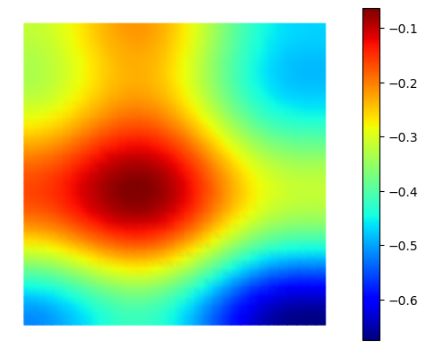
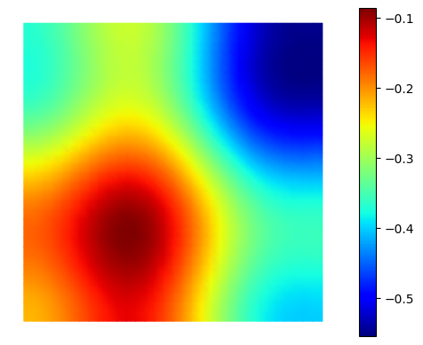
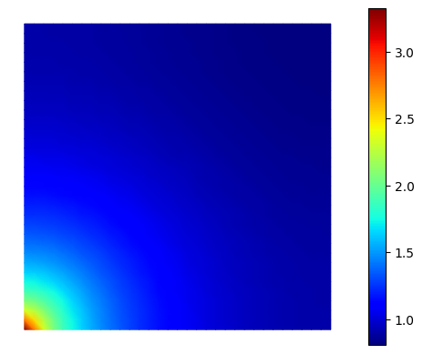
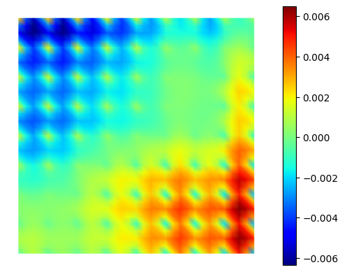

# THE PBDW method


```python
import sys
!{sys.executable} -m pip install numpy
!{sys.executable} -m pip install matplotlib
!{sys.executable} -m pip install scikit-fem
```

#### Let us present one method that combines model order reduction and a data assimilation problem: the Parametrized-Background Data-Weak method (PBDW). 
The PBDW method exploits data observations and the knowledge of a parameterized best-knowledge (bk) model that describes the physical system, to improve performance. We denote by $u^{bk}(\mu) \in \mathcal{U}$, the solution to the parameterized model for the parameter value $\mu \in \mathcal{P}^{bk}$, 
                                                                                                                                             $$ G^{bk,\mu}(u^{bk}(\mu)) = 0.$$
Here, $G^{bk,\mu}(\cdot)$ denotes the parameterized bk model associated with the system, and $\mathcal{P}^{bk} \subset \mathbb{R}^P$ is a compact set that reflects the lack of knowledge in the value of the model parameters. We further define the bk solution manifold
$$ \mathcal{M}^{bk} = \{u^{bk}(\mu) : \mu \in \mathcal{P}^{bk}\}.$$

The PBDW formulation integrates the parameterized mathematical model $G^{pb}$ and $M$ experimental observations associated with a parameter configuration $\mu^{true}$ to estimate the true field $u^{true}(\mu^{true})$ as well as any desired output $l_{out}(u^{true}(\mu^{true}\
)) \in \mathbb{R}$ for given output functional $l_{out}$.                                                                                                                  
We intend that $\lVert u^{true}(\mu^{true})-u^{bk}(\mu^{true}) \rVert$ is small (i.e. that our model represents our data observations well).

The PBDW is decomposed in two parts: one offline and one online.

In the following notebook, we will employ:
- as our model problem a Helmholtz equation,
- some measures that could also be possibly be noisy (here we will consider the case with no noise),
- a sequence of background spaces that reflect our (prior) best knowledge model bk, 
- gaussians for our observations with a proper choice of localization.
  
We will create measures artificially from our model problem by modifying the right hand side of our equation and the boundary conditions.

To generate the sequence of background spaces, we will employ a POD basis (but any other offline algorithm could be used such as a weak-Greedy procedure). We will denote these spaces by 
$$\mathcal{Z}_1 \subset \dots \subset \mathcal{Z}_{N} \subset \mathcal{U}. $$                                                                                                                                                                                                              
To sum up, we consider two main ingredients:                                                                                                                                                                                                               
- a model with a bias leading to the $(\mathcal{Z}_n)_n$ sequence,                                                                                                                                                                        
- and true measures, that might be noisy.                                                                                                                                                                                               
                                                                                                                                              


```python
# import packages
import skfem  # for Finite Element Method
import numpy as np
import matplotlib.pyplot as plt
```

## The 2D Helmholtz model problem:

We are going to use in this example a 2D  Helmholtz problem with the Finite Element Method (FEM), which consists in 
solving on a unit square (denoted $\Omega$) the following equation:
$$a^{\mu}(u,v)=f^{\mu}_g \forall v \in \mathcal{U}$$,
where
$$\begin{align*}
&a^{\mu}(w,v)=(1+i \varepsilon \mu) \int_{\Omega} \nabla w \cdot \nabla v - \mu^2\int_{\Omega} w v, \ \forall w,v \in \mathcal{U},\\
& f^{\mu}_g(v)=\mu \int_{\Omega} (2 x_1^2 + np.exp(x_2)) v + \mu \int_{\Omega} g v, \  \forall v \in \mathcal{U},
\end{align*}$$
where $u \in \mathcal{U}:=H^1(\Omega)$ represents the unknown, $\mu \in [2,10]$ is our variable parameter, $\varepsilon=10^{-3}$ is the fixed dissipation, and $g \in L^2(\Omega)$ is a function that allow us to construct a model with a bias with respect to the data observations. The lack of knowledge of the value of $\mu$ constitutes the anticipated parametric ignorance in the model, while uncertainty in $g$ constitutes the unanticipated non-parametric ignorance.
We endow $\mathcal{U}$ with the standard $H^1$ inner product and norm:
$(w,v)= \int_{\Omega} \nabla w \cdot \nabla v + wv$ and $\lVert w \rVert= \sqrt{(w,w)}$.
We employ $P1$ finite elements to get a proper solution and obtain the system $\mathbf{A} \mathbf{x} =\mathbf{f}$ to solve where the assembled matrix $\mathbf{A}$ corresponds to the bilinear part $a^{\mu}(w,v) $.

This problem model comes from the paper "A parameterized-background data-weak approach to variational data assimilation: formulation, analysis, and application to acoustics "(https://dspace.mit.edu/bitstream/handle/1721.1/97702/Patera_A%20parameterized.pdf?sequence=1&isAllowed=y).


```python
# First we define a mesh for the unit square
mesh= skfem.MeshTri().refined(5).with_boundaries(                                                                
        {                                                                                                                                
            "left": lambda x: x[0] == 0,                                                                                            
            "right": lambda x: x[0] == 1,            
            "down": lambda x: x[1] == 0,                                                                                            
            "up": lambda x: x[1] == 1,     
            
        }                                                                                                                               
)

print(mesh)
mesh

```

    <skfem MeshTri1 object>
      Number of elements: 2048
      Number of vertices: 1089
      Number of nodes: 1089
      Named boundaries [# facets]: left [32], bottom [32], right [32], top [32], down [32], up [32]


    

    


```python
# Assembling matrices

from skfem.assembly import BilinearForm, LinearForm
from skfem.helpers import grad, dot

# Bilinear form 
@BilinearForm
def laplace(u, v, _):
    return dot(grad(u), grad(v))

@BilinearForm
def mass(u, v, _): #H1 norm (norm for the space U)
    return u * v +dot(grad(u), grad(v))

@BilinearForm
def L2mass(u, v, _): #L2 norm
    return u * v 

"""Right-hand side function with f =  [ 2*x1^2 + exp(x2) ] + g """ 
@LinearForm
def rhs_f(v,w):
    x1, x2 = w.x[0], w.x[1]
    return  (2 * x1**2 + np.exp(x2)) * v 
@LinearForm
def rhs_f2(v,w):
    return w.g * v 
```

In the code bellow, the function SolveHelmoltzProblem(mu,Mesh,measures) takes as inputs the parameter $\mu \in \mathcal{P}^{bk} \subset \mathbb{R}$, a mesh, and a boolean used for the bias on the right-hand side function, and it returns the associated solution.


```python
from skfem import *
# Compute solution 
element = ElementTriP1() #P1 FEM elements

def SolveHelmholtzProblem(mu,Mesh,measures):
    # mu: variable parameter
    # mesh: FE mesh
    # measures: Boolean (if true, the right-hand side function and dirichlet parameter are adapted to the generation of the data observations)
    basis = Basis(Mesh, element) 
    print('Parameter mu:',mu)
    
    ## Assembling global problem
    A= laplace.assemble(basis)
    A=A.astype(np.complex128)
    A*=(1 + 1j * 1e-3 * mu)
    A2=L2mass.assemble(basis)
    A-=mu**2*A2.astype(np.complex128)

    ## Right hand side functions
    if measures==True:
        g1 = lambda x: 0.5*np.exp(-x[0])+np.cos(1.3*np.pi*x[1]) #with g!=0
        g_proj1 = basis.project(g1)
    else:
        g1 = lambda x: 0 #with g=0
        g_proj1 = basis.project(g1)
        
    f=rhs_f.assemble(basis)
    f*=mu
    f+=mu*rhs_f2.assemble(basis,g=basis.interpolate(g_proj1))
    u = solve(A,f)

    return u
    

```


```python
## plot the solution

from skfem.visuals.matplotlib import plot, draw, savefig

u=SolveHelmholtzProblem(8,mesh,True) #
plot(mesh, u.real, shading='gouraud', colorbar=True)

u=SolveHelmholtzProblem(8,mesh,False) # examples
plot(mesh, u.real, shading='gouraud', colorbar=True)

```

    Parameter mu: 8
    Parameter mu: 8


    <Axes: >


    

    


    

    


## The PBDW method

We are now able to proceed with the offline and online parts of the PBDW method.
We start with a classical POD algorithm on the bk model with bias, but first we construct the data observations $u^{true}(\mu^{true})$ artificially (here we consider that we have access to the data in the whole domain).

### OFFLINE PART


We define one fine mesh called "FineMesh" in the code


```python
## FINE MESH
FineMesh = skfem.MeshTri().refined(5).with_boundaries(                                                                
        {                                                                                                                                
            "left": lambda x: x[0] == 0,                                                                                            
            "right": lambda x: x[0] == 1,            
            "down": lambda x: x[1] == 0,                                                                                            
            "up": lambda x: x[1] == 1,     
            
        }                                                                                                                               
)
FineBasis = Basis(FineMesh, element)

NumberOfNodesFineMesh = FineMesh.p.shape[1]
print("number of nodes: ",NumberOfNodesFineMesh)
num_dofs_uFineMesh = FineBasis.doflocs.shape[1] # or np.shape(u)[0] for DOFs
print("number of DoFs: ",num_dofs_uFineMesh)

massMat=mass.assemble(FineBasis) #H1 norm for U
L2massMat=L2mass.assemble(FineBasis) #L2 norm 
```

    number of nodes:  1089
    number of DoFs:  1089


```python
utrue=SolveHelmholtzProblem(6,mesh,True).real # True for measures
plot(FineMesh, utrue.real, shading='gouraud', colorbar=True)
```

    Parameter mu: 6


    <Axes: >


    

    


```python

```

#### POD on bk model


```python
""" POD on the bk model (could be done with a greedy approach) """
print("-----------------------------------")
print("        Offline POD                ")
print("-----------------------------------")

NumberOfSnapshots=0
NumberOfModesN=15
print("number of modes for the bk model: ",NumberOfModesN)

mu1list=np.linspace(2,10,30) #P^bk

FineSnapshots=[]

for mu1 in (mu1list):
   u=SolveHelmholtzProblem(mu1,FineMesh,False) # False = model with bias 
   FineSnapshots.append(u.real)
   NumberOfSnapshots+=1

## SVD ##
 
# We first compute the correlation matrix C_ij = (u_i,u_j)_U
CorrelationMatrix = np.zeros((NumberOfSnapshots, NumberOfSnapshots))
for i, snapshot1 in enumerate(FineSnapshots):
    MatVecProduct = massMat.dot(snapshot1)
    for j, snapshot2 in enumerate(FineSnapshots):
        if i >= j:
            CorrelationMatrix[i, j] = np.dot(MatVecProduct, snapshot2)
            CorrelationMatrix[j, i] = CorrelationMatrix[i, j]

# Then, we compute the eigenvalues/eigenvectors of C 
EigenValues, EigenVectors = np.linalg.eigh(CorrelationMatrix, UPLO="L") #SVD: C eigenVectors=eigenValues eigenVectors
idx = EigenValues.argsort()[::-1] # sort the eigenvalues

TotEigenValues = EigenValues[idx]
TotEigenVectors = EigenVectors[:, idx]
EigenValues=TotEigenValues[0:NumberOfModesN]

EigenVectors=TotEigenVectors[:,0:NumberOfModesN]
print("eigenvalues: ",EigenValues)

RIC=1-np.sum(EigenValues)/np.sum(TotEigenValues) #must be close to 0
print("Relativ Information Content:",RIC)

ChangeOfBasisMatrix = np.zeros((NumberOfModesN,NumberOfSnapshots))

for j in range(NumberOfModesN):#orthonormalization
    ChangeOfBasisMatrix[j,:] = EigenVectors[:,j]/np.sqrt(EigenValues[j])

bkReducedBasis = np.dot(ChangeOfBasisMatrix,FineSnapshots)

```

    -----------------------------------
            Offline POD                
    -----------------------------------
    number of modes for the bk model:  15
    Parameter mu: 2.0
    Parameter mu: 2.2758620689655173
    Parameter mu: 2.5517241379310347
    Parameter mu: 2.8275862068965516
    Parameter mu: 3.103448275862069
    Parameter mu: 3.3793103448275863
    Parameter mu: 3.655172413793103
    Parameter mu: 3.9310344827586206
    Parameter mu: 4.206896551724138
    Parameter mu: 4.482758620689655
    Parameter mu: 4.758620689655173
    Parameter mu: 5.0344827586206895
    Parameter mu: 5.310344827586206
    Parameter mu: 5.586206896551724
    Parameter mu: 5.862068965517241
    Parameter mu: 6.137931034482759
    Parameter mu: 6.413793103448276
    Parameter mu: 6.689655172413793
    Parameter mu: 6.9655172413793105
    Parameter mu: 7.241379310344827
    Parameter mu: 7.517241379310345
    Parameter mu: 7.793103448275862
    Parameter mu: 8.068965517241379
    Parameter mu: 8.344827586206897
    Parameter mu: 8.620689655172413
    Parameter mu: 8.89655172413793
    Parameter mu: 9.172413793103448
    Parameter mu: 9.448275862068964
    Parameter mu: 9.724137931034482
    Parameter mu: 10.0
    eigenvalues:  [1.01034517e+03 3.14725998e+01 1.11418560e+01 7.61819228e+00
     3.17560408e-02 3.50163923e-04 1.48325454e-04 8.73000096e-05
     5.92237907e-05 1.06624287e-07 4.44776120e-08 2.14326995e-09
     1.19343957e-10 3.07285654e-11 2.49205387e-12]
    Relativ Information Content: 0.0


Now we can check for the reduced basis accuracy.


```python
print("-----------------------------------")
print("             Reduced basis accuracy")
print("-----------------------------------")
### Offline Errors
print("Offline Errors")
CompressionErrors=[]
H1compressionErrors=[]

for snap in FineSnapshots:
    ExactSolution =snap
#for mu1 in (mu1list):
        
    #xactSolution=SolveAdvDiffProblem([mu1,mu2],FineMesh,True)
    #ExactSolutionbis=SolveAdvDiffProblem([mu1,mu2],FineMesh,False)
    CompressedSolutionU= ExactSolution@(massMat@bkReducedBasis.transpose())
    ReconstructedCompressedSolution = np.dot(CompressedSolutionU, bkReducedBasis) #pas de tps 0

    norml2ExactSolution=np.sqrt(ExactSolution@(L2massMat@ExactSolution))
    normh1ExactSolution=np.sqrt(ExactSolution@(massMat@ExactSolution))
    t=ReconstructedCompressedSolution-ExactSolution
    
    if norml2ExactSolution !=0 and normh1ExactSolution != 0:
        relError=np.sqrt(t@L2massMat@t)/norml2ExactSolution
        relh1Error=np.sqrt(t@massMat@t)/normh1ExactSolution
    else:
        relError = np.linalg.norm(ReconstructedCompressedSolution-ExactSolution)    
    CompressionErrors.append(relError)
    H1compressionErrors.append(relh1Error)
    
print("L2 compression error =", CompressionErrors)
print("H1 compression error =", H1compressionErrors)


```

    -----------------------------------
                 Reduced basis accuracy
    -----------------------------------
    Offline Errors
    L2 compression error = [4.47723597734413e-09, 1.2412688696194867e-09, 5.3217835620566985e-09, 9.315054003652782e-09, 2.0053826551050353e-09, 8.935416982510058e-09, 3.6281279110157356e-09, 2.3246903303759604e-09, 4.242167460944145e-09, 1.6904507008456697e-09, 5.1110407182999855e-09, 6.179020607280952e-09, 6.620549534117255e-09, 6.277701339382233e-09, 4.570356099243686e-09, 2.9322241336573282e-09, 1.5050759608196056e-09, 7.193808841528347e-09, 1.11508877967376e-09, 6.153135190477892e-09, 1.1846202532422098e-08, 1.4538158735678029e-08, 9.193717925713014e-09, 9.228672070244114e-09, 2.7718031439898604e-08, 8.666874082663221e-09, 9.78190461864707e-09, 4.444635785714987e-09, 7.311025348174467e-10, 2.1534826928028318e-10]
    H1 compression error = [3.319589322603513e-08, 9.439645055777123e-09, 1.0958700353501982e-08, 1.3723228742437914e-08, 6.37163985760987e-09, 1.2879166458926225e-08, 1.167850442158435e-08, 9.593621277903067e-09, 7.164986926856745e-09, 9.410076827511853e-09, 1.89443762694241e-08, 3.1086642334338374e-08, 3.815373714456544e-08, 3.5519321674270044e-08, 1.952071026929563e-08, 6.702422865285836e-09, 2.826887039317766e-09, 1.537914264153323e-08, 3.6653386840663264e-09, 3.3891758575605295e-08, 6.592436941669615e-08, 8.715796909206848e-08, 5.375796368500121e-08, 4.024049941905735e-08, 1.3575373131696628e-07, 2.9424013097193815e-08, 1.2854934657753352e-08, 2.9607146270723654e-09, 1.3950239075621673e-09, 6.864694560773913e-10]


#### Construction of the sensors                                                                       
We now characterize our measures:

We will consider $M$ data  $y^{obs}(\mu^{true})\in \mathbb{C}^M$, obtained from sensors at different localizations such that:                                                                              
 $$\forall m=1,\dots,M, y_m^{obs}=l^0_m(u^{true}(\mu^{true})).$$                                                    
Here $y_m^{obs}(\mu^{true})$ is the value of the $m$-th observation, with $l_m^0 \in \mathcal{U}'$.                                          The form of the observation functional depends on the specific transducer used to acquire data. For instance, if the transducer measures a local state value, then we may model the observation as a Gaussian convolution (like in this example).

We first associate with each observation functional $l_m^0 \in \mathcal{U}'$ an observation function                                                                                                                                            
$$\forall m=1,\dots,M, \ q_m = R_u l^0_m,$$                                                                                                                                                                                            
which is the Riesz representation of the functional. 
The condition $(q_m,v)=l_m^0(v)$ is equivalent to the resolution of the following problem: 

Find $q_m \in \mathcal{U}$ such that:
$M q_m=b$ with $M $ the mass matrix and $b$ the vector obtained from the observation functionals $b_i=l_m^0(v_i)$ where $v_i$ are the FEM test functions. 

Then we introduce hierarchical observation spaces $\mathcal{U}_M \subset \mathcal{U}$ such that  
$$\forall M=1,\dots,M_{max},\ \mathcal{U}_M=\textrm{Span} \{ q_m\}_{m=1}^M. $$

We want to choose the localization of the sensors adequately in order to get $M$ small such that $(q_m)_{m=1}^M \in (\mathcal{U}_M)^M$ forms a canonical reduced basis of the observation spaces.

In our example, we consider Gaussian observation functionals with standard deviation $r_w = 0.01$:
$$l_m(v)=l_m(v,x_m,r_w)=C \int_{\Omega} exp \Big(-\frac{1}{2r_w^2}\lVert x-x_m \rVert_2^2 \Big) v(x) \ \textrm{dx},$$
where $C$ is such that $l_m(1)=1$, and $x_m$ corresponds to the center of the $m$-sensor localization.
In this example, we take these centers as the nodes of a coarser mesh but we could have used a GEIM to choose them more wisely.


```python
rw = 0.01  # deviation r_w
xm = np.array([0.5, 0.5]) #for test

## Normalization of the gaussian functionals
## lm = C exp(-||x - x_m||^2 / (2 * r_w^2))
def gaussian_weight_noC(x,xm):
    """ Gaussian function centered on xm of deviation rw (to find C for normalization). """
    return np.exp(-0.5 * np.sum((x - xm[:, np.newaxis,np.newaxis])**2, axis=0) / rw**2)

def compute_C(xm):
    # takes xm center of sensor as parameter
    
    @LinearForm
    def lm(v, w):
        """ Computes lm(1) by integrating the Gaussian weight. """
 
        weight = gaussian_weight_noC(w.x,xm)
        return weight * v 

    # Assemble the linear form for lm(1)
    b = lm.assemble(FineBasis)
    lm_value = np.sum(b)  # Numerical integration result: b@1 since v=1
    
    C = 1.0 / lm_value  # Scaling factor
    return C

C = compute_C(xm)

```


```python
# lm = C exp(-||x - x_m||^2 / (2 * r_w^2))
def gaussian_weight(x,xm,C):
    """ Gaussian function centered on xm of deviation rw """
    return C*np.exp(-0.5 * np.sum((x - xm[:, np.newaxis,np.newaxis])**2, axis=0) / rw**2)

def qm_b(xm,C):
    # weak formulation
    # mass matrix : (v, q_m)_U
    
    @LinearForm
    def rhs(v, w):
        """ Right hand side  """
        weight = gaussian_weight(w.x,xm,C)  # Applique la gaussienne
        return weight * v

    # Assembling
    b = rhs.assemble(FineBasis)

    # Solving the linear system
    from scipy.sparse.linalg import spsolve
    #from scipy.sparse.linalg import cg
    #q_m, info = cg(M, b)
    #if info == 0:
    #    print("Conjugate Gradient converged!")
    #else:
    #    print("Conjugate Gradient did not converge.")
    
    q_m = spsolve(massMat, b)  # Resolution of M @ q_m = b
    return q_m
```


```python
# sensors localizations from a coarser mesh M=25
## Coarse MESH
CoarseMesh = skfem.MeshTri().refined(3).with_boundaries(                                                                
        {                                                                                                                                
            "left": lambda x: x[0] == 0,                                                                                            
            "right": lambda x: x[0] == 1,            
            "down": lambda x: x[1] == 0,                                                                                            
            "up": lambda x: x[1] == 1,     
            
        }                                                                                                                               
)

xm_grid=CoarseMesh.p #xm = nodes

qmReducedBasis=np.zeros((num_dofs_uFineMesh,CoarseMesh.p.shape[1]))
for i in range(CoarseMesh.p.shape[1]):
    xm=xm_grid[:,i] #update xm
    C = compute_C(xm) # find C for normalization
    qmReducedBasis[:,i]=qm_b(xm,C) # generate qm
        
plot(FineMesh, qmReducedBasis[:,0], shading='gouraud', colorbar=True)
 
    
NumberOfModesM=np.shape(qmReducedBasis)[1]
```


    

    


Now we have two kind of basis functions:
- the $\Phi_i \in \mathcal{Z}_N$ for $i=1,\dots,N$ (in the code bkReducedBasis),
- the $q_j \in \mathcal{U}_M$, for $j=1,\dots,M$ (in the code qmReducedBasis).

#### PBDW algebraic form
We now state the algebraic form of the PBDW problem.
We need to compute  $(A)_{i,j}=(q_i,q_j)$ and $(B)_{i,j}=(\Phi_j,q_i)$ and to assemble $K= \begin{pmatrix} A & B \\
B^T & 0 \end{pmatrix}$ in order to solve $\begin{pmatrix} \eta_M \\ z_N \end{pmatrix} = K^{-1} \begin{pmatrix} y^{obs} \\ 0 \end{pmatrix}$


```python
print("---------------------------------------")
print("---- OFFLINE PART: BUILDING MATRICES --")
print("---------------------------------------")

############################################
## Assembling A and B  #####################
############################################

AMat=massMat
BMat=massMat

#############################################
## Project matrices onto the reduced space ##
#############################################

Areduced = np.zeros((NumberOfModesM, NumberOfModesM))
Breduced = np.zeros((NumberOfModesM, NumberOfModesN))

for i in range(NumberOfModesM):
    MatAVecProduct = AMat.dot(qmReducedBasis[:,i])
    for j in range(NumberOfModesM):
        if j>=i:
            Areduced[i,j] = np.dot(qmReducedBasis[:,j],MatAVecProduct)
            Areduced[j,i] = Areduced[i,j]

for i in range(NumberOfModesM):
    MatBVecProduct = BMat.dot(qmReducedBasis[:,i])
    for j in range(NumberOfModesN):
        Breduced[i,j] = np.dot(bkReducedBasis[j],MatBVecProduct)
         
            

Kreduced = np.zeros((NumberOfModesN+NumberOfModesM,NumberOfModesN+ NumberOfModesM))
#fill global K
for i in range(NumberOfModesM):
    for j in range(NumberOfModesM):
        Kreduced[i,j]=Areduced[i,j]

for i in range(NumberOfModesM):
    for j in range(NumberOfModesN):
        Kreduced[i,NumberOfModesM+j]=Breduced[i,j]
        Kreduced[NumberOfModesM+j,i]=Breduced[i,j]


```

    ---------------------------------------
    ---- OFFLINE PART: BUILDING MATRICES --
    ---------------------------------------


#### ONLINE PART

We can now solve $\begin{pmatrix} \eta_M \\ z_N \end{pmatrix} = K^{-1} \begin{pmatrix} y^{obs} \\ 0 \end{pmatrix}$
and we approximate $u^{true}(\mu^{true})$ by $u=\sum_{i=1}^M (\eta_M)_i \ q_i +\sum_{i=1}^N (z_N)_i \ \Phi_i $.


```python
# Construct the observations from the basis (qm)_m and the true data
yobs = np.zeros(NumberOfModesM)

#mu1=mu1list[1]
#utrue=SolveHelmholtzProblem(5,FineMesh,True).real
        
# Compute (q_m, v)_U
qm_inner =utrue@ massMat

for i in range(NumberOfModesM):    
    yobs[i] =qm_inner.dot(qmReducedBasis[:,i])


print("--------------------------------------------")
print("---- ONLINE PART: SOLVING REDUCED PROBLEM --")
print("--------------------------------------------")

RightHandSide= np.concatenate([yobs, np.zeros(NumberOfModesN)]) 


## SOLVING PROBLEM ##
#EtaZ=np.linalg.solve(Kreduced,RightHandSide)
#Eta, Z = EtaZ[:NumberOfModesM],EtaZ[NumberOfModesM:]
#print("norm",np.linalg.norm(Areduced@Eta+Breduced@Z-yobs))
#print("norm",np.linalg.norm(Breduced.transpose()@Eta))

# more stable:
Z=np.linalg.solve(np.dot(np.dot(Breduced.transpose(),np.linalg.inv(Areduced)),Breduced),np.dot(np.dot(Breduced.transpose(),np.linalg.inv(Areduced)),yobs))
Eta=np.linalg.solve(Areduced,yobs-np.dot(Breduced,Z))
u=np.dot(Eta,qmReducedBasis.transpose())+np.dot(Z,bkReducedBasis)

ExactSolution =utrue #exact observations
ReconstructedCompressedSolution = u #reduced solution
    
norml2ExactSolution=np.sqrt(ExactSolution@(L2massMat@ExactSolution))
normh1ExactSolution=np.sqrt(ExactSolution@(massMat@ExactSolution))
t=np.abs(ReconstructedCompressedSolution-ExactSolution)
if norml2ExactSolution !=0 and normh1ExactSolution != 0:
    relError=np.sqrt(t@L2massMat@t)/norml2ExactSolution
    relh1Error=np.sqrt(t@massMat@t)/normh1ExactSolution
    
else:
    relError = np.linalg.norm(ReconstructedCompressedSolution-ExactSolution)
    
print("L2 rel error: ",relError)
print("H1 rel error: ",relh1Error)

plot(FineMesh,utrue, shading='gouraud', colorbar=True)
plot(FineMesh,u, shading='gouraud', colorbar=True)
#plot(FineMesh,np.dot(Z,bkReducedBasis), shading='gouraud', colorbar=True)
#plot(FineMesh,Eta.dot(qmReducedBasis.transpose()), shading='gouraud', colorbar=True)
#plot(FineMesh,np.dot(Z,bkReducedBasis)-utrue, shading='gouraud', colorbar=True)
plot(FineMesh,u-utrue, shading='gouraud', colorbar=True)
```

    --------------------------------------------
    ---- ONLINE PART: SOLVING REDUCED PROBLEM --
    --------------------------------------------
    L2 rel error:  0.003289101212691039
    H1 rel error:  0.00945153090424034


    <Axes: >


    

    


    

    


    

    


```python

```


```python

```


```python

```
